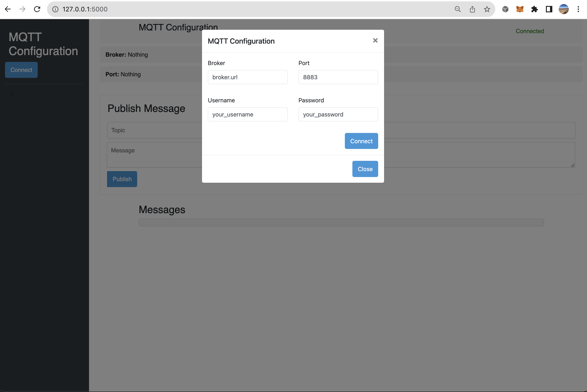
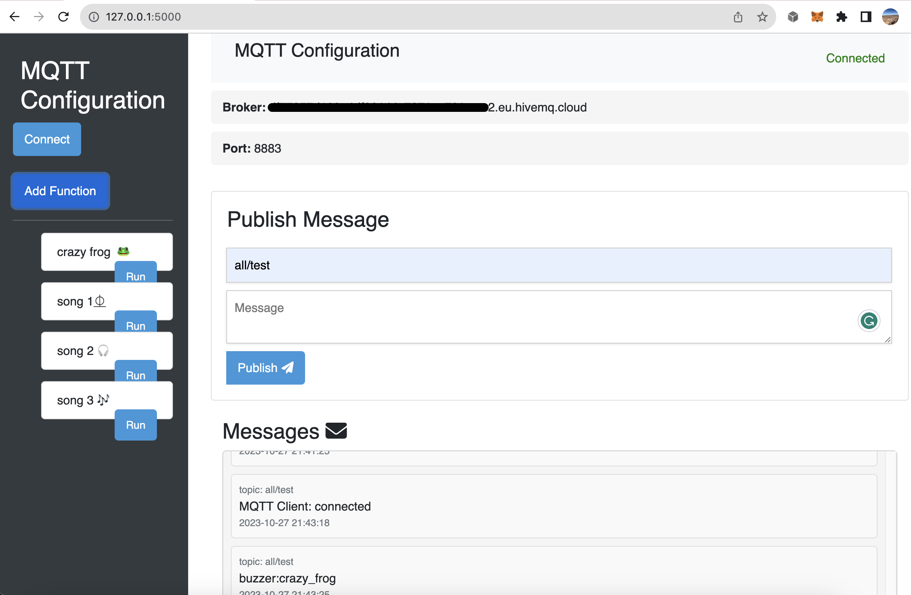

# MQTT Starter Pack

In this repo , a basic user interface for communicating with a MQTT server is provided along with a micropython mqtt_standard interface

#### Learn About MQTT 
- [MQTT Documentation](https://mqtt.org/)
#### Learn about the HiveMQ server
- [HiveMQ Documentation](https://www.mqtt-dashboard.com)


# Getting Started
You can read the implementation documentation at `DOC.md`

<p float="left">


</p>


### Installing the requirements
```
python3 -m venv venv
source venv/bin/activate
pip install -r requirements.txt
```

### Using the appropriate MqttClient class
- Micropython: MqttMicroprocessor
- Desktop: MqttStandard

----


## Client
For more information view: `client/README.md` readme for more information.<br>
The MQTTStandard class builds upon the `paho` library. 

## IOT Devices
For any microprocessor running micropython you can use this library.
For more information view: `micropython/README.md`<br>
MqttMicroprocessor class builds upon the `umqtt.simple` library. 